# CITS5505_Group_Project
This project is to develop a web application to create a forms for Computer programming language

## Overview:
This web application is primarily designed as a learning Q&A and career preparation platform for students in the UWA, CSSE (Computer Science and Software Engineering) college. Currently, the main platform used by everyone to search for answers to computer-related questions is something like Stack Overflow. However, Stack Overflow is too large and general, which results in very low search efficiency, and often the answers are not suitable and cannot solve the problem. Additionally, although each unit has relevant Q&A platforms on Teams or LMS, they are mostly very scattered, brief, lacking categorization and tagging, and students can only see very recent ones, with past records being invisible. Therefore, this application addresses the issues that the above two platforms cannot simultaneously address and can provide questions and answers related to courses under the CSSE college.Besides, they can also exchange the experiences about career preparation.

## Group Members:
| UWA ID     | Name         | Github Username |
|------------|--------------|-----------------|
| 23737198   | Jinsen Lou       | Jinsen_Lou |
| 22917174   | Raman Datta      | ramandatta87 |
| 23242469   | Qian Zhang       | zhangqianalone |

## Function
### 1. User Account Management
Allow users to create accounts, log in, and log out, manage their profiles, and reset password.
#### Create Account(Sign up)
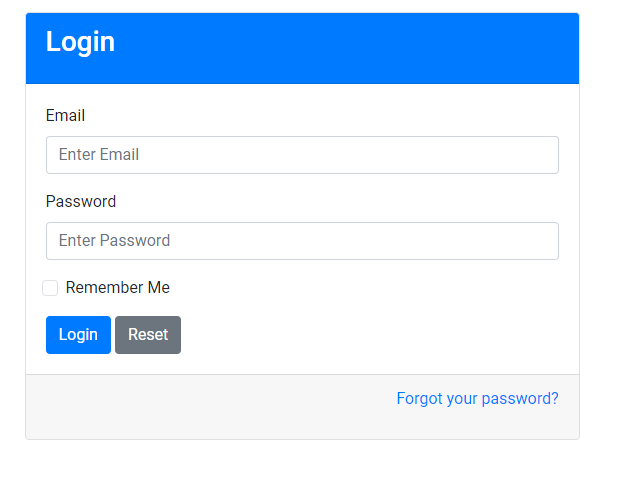
#### Log in the account

#### Remeber me
If users click the "remeber me" box, the user will keep logging in current account except the user logs out the account.

#### Log out the account

#### Manage the profile


### 2. Question Posting and Editing
Users can post new questions and edit/update existing ones. Users can also save an unfinished question as a draft, and edit/post it in my draft posts.
#### Question posting
This form allows users to submit questions on the web application. It features several fields that need to be filled out before submission:
- **Title**: The title of the question users wish to ask.
- **Tag**: Relevant tags to categorize the question, which help in navigating and searching for questions within the system.
- **Question Type**: Users can select between two types of questions:
  - `Unit Question` - Pertaining to specific units or modules in a course.
  - `Career Preparation` - Questions aimed at career advice or professional growth.
- **Content**: The main text area where users can type the content of their question. The text editor supports various formatting options like bold, italic, list, quote, and code formatting.
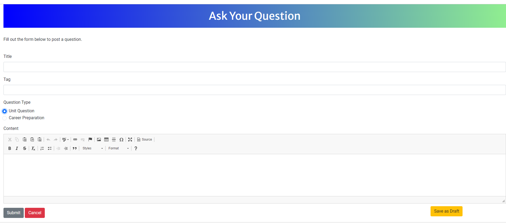

#### View and reply question users have post
In the "My Posts" section of the web application, users can view their previously posted questions and respond to posts from other users. Each post is displayed with relevant details such as the title, tag, and the author's name, along with the date it was posted. Users can also enter replies to any post viewed.
Upon navigating to the "My Posts" section, users are presented with a list of their questions. Each question is displayed in a box that includes:
- **Title**: Clearly displayed at the top.
- **Tag**: Shows the categorization tag for quick reference.
- **Author**: The name of the user who posted the question.
- **Date Posted**: The specific date the question was posted.
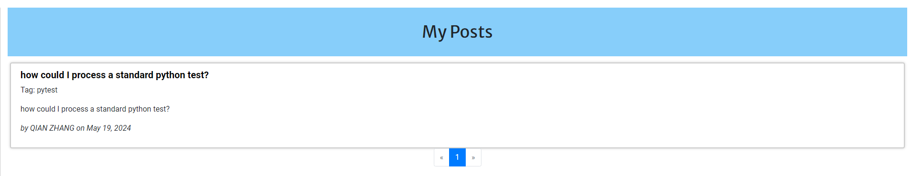

When a user clicks on a question, they are taken to a detailed view where they can read the full content of the question and see existing replies. Below the replies section, there is an input area where users can type their answer:
- **Your Answer**: A text box where users can write a reply to the question.
- **Submit Button**: After typing their response, users can submit it by clicking this button.
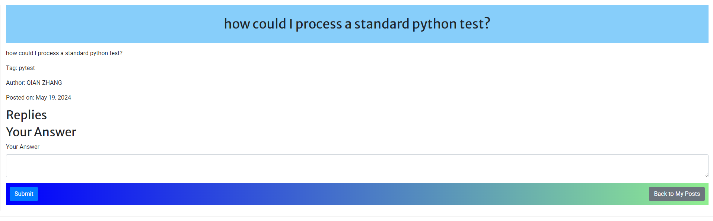


### 3. Question Search and Answer Questions
User can click different buttons to access to different categories for questions.User can access Search function to input keywords for interesting topic, and users can also use synatax: [tag] keyword to search quesitons under specific tags.  
#### Quesitons View through sidebar menu
The sidebar menu includes the following main components for navigation:
- **Ask Question**: Directs users to a form to submit a new question.
- **All Posts**: Displays all questions posted on the platform.
- **Tags**: Lists all tags used in the questions, allowing users to click on a tag to see all related posts.
- **Career Preparation**: Filters and shows posts related to career advice and professional development.
- **Unit Preparation**: Filters and shows posts related to specific academic or training units.
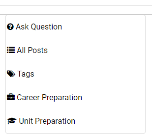
##### All Post, and Filter questions via  **Career Preparation** and **Unit Preparation**
Upon selecting a category such as "Unit Preparation" or "Career Preparation," users are presented with a list of relevant questions. Each question is displayed with:
- **Title**: A brief description of the question.
- **Tag**: Relevant tags that categorize the question.
- **Author**: The name of the user who posted the question.
- **Date**: When the question was posted.
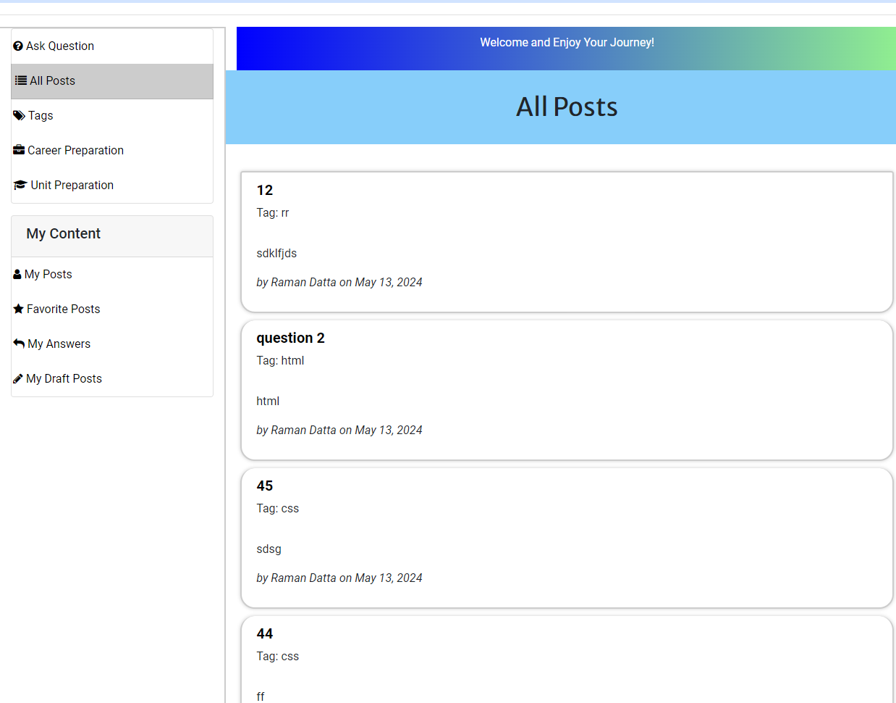
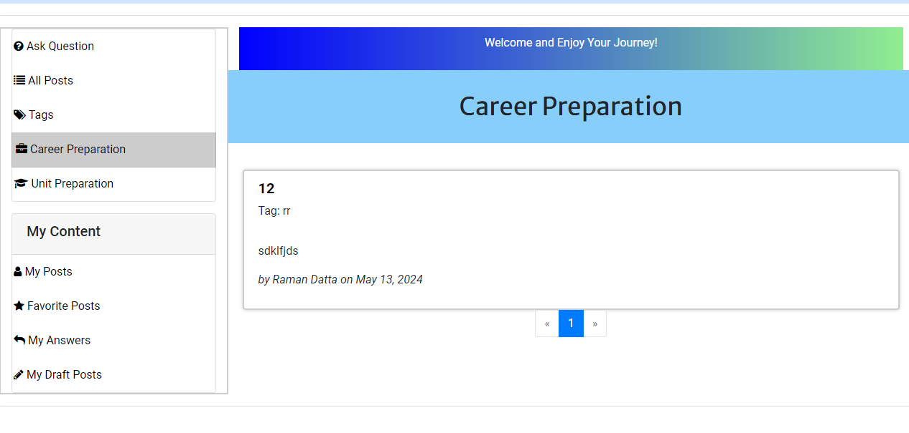
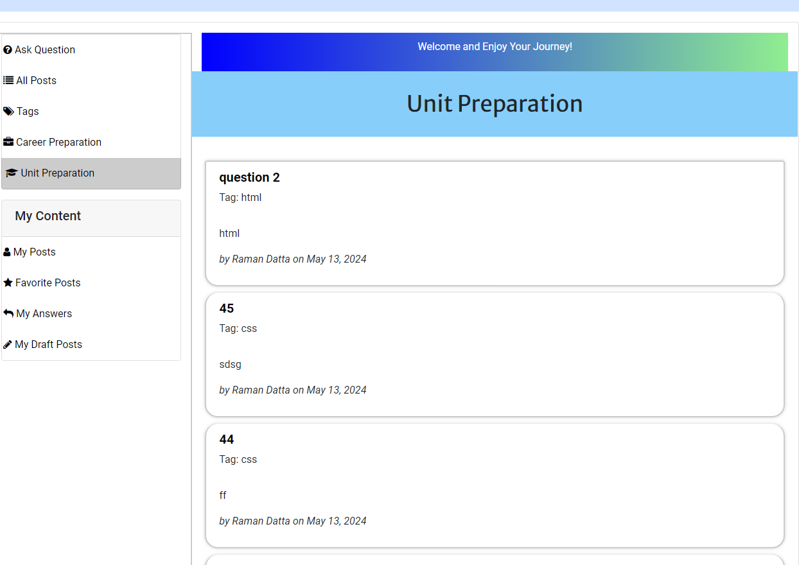
##### Post filter under tags
By selecting "Tags" from the sidebar, users can view a comprehensive list of all tags used within the platform, each displaying the count of associated posts. Clicking on a tag filters the posts accordingly.
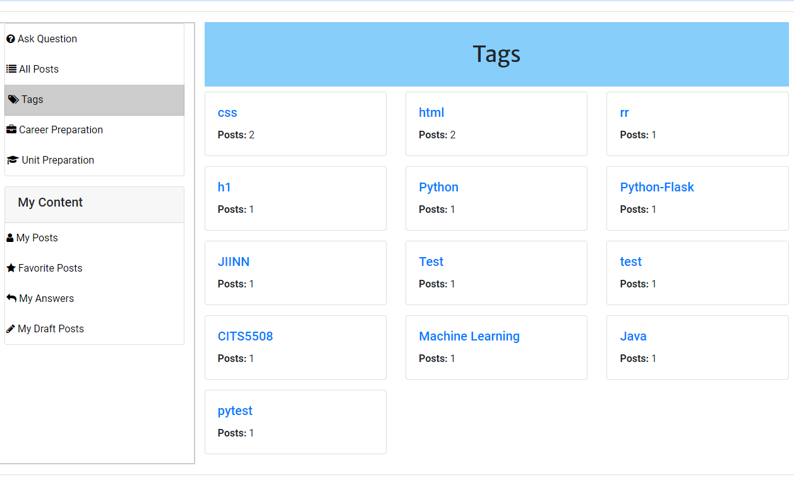

#### Quesitons View through Search
The search functionality in the application allows users to efficiently find questions based on keywords and tags. This powerful tool supports searching by just keywords or a combination of a tag and keywords to provide precise results.
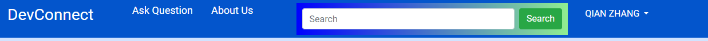
##### Keyword Search
Users can type any keyword related to the questions they are interested in into the search box and press the "Search" button. The application will retrieve all questions that contain the keyword in the title, tags, or content.
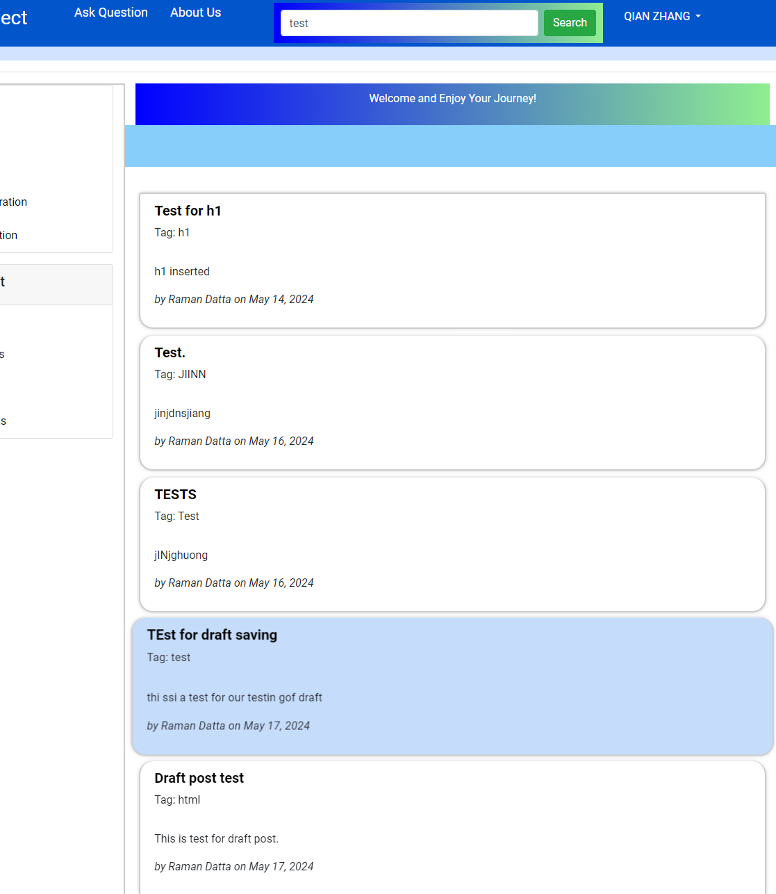
##### Tag and Keyword Search
To refine search results to include specific tags, users should use the format `[tag] keyword` in the search box. For example, entering `[pytest] test` will return questions tagged with 'pytest' and containing the word 'test'.
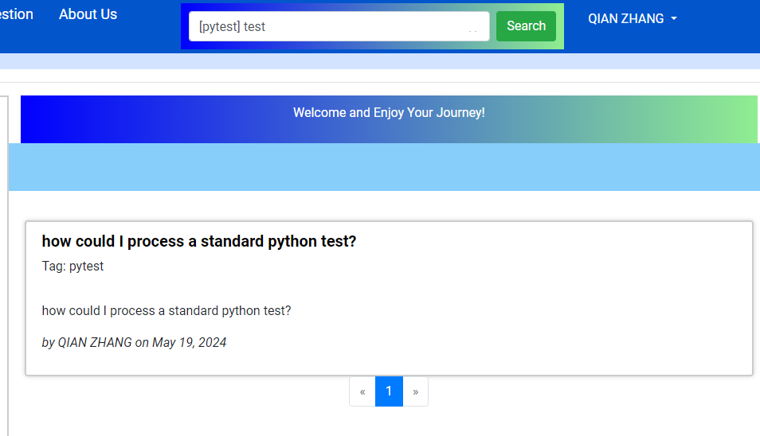

#### Answer Question
This application allows users to view detailed information about a specific question, see existing replies, and contribute their own answers. This functionality is central to fostering an interactive and helpful community on the platform.
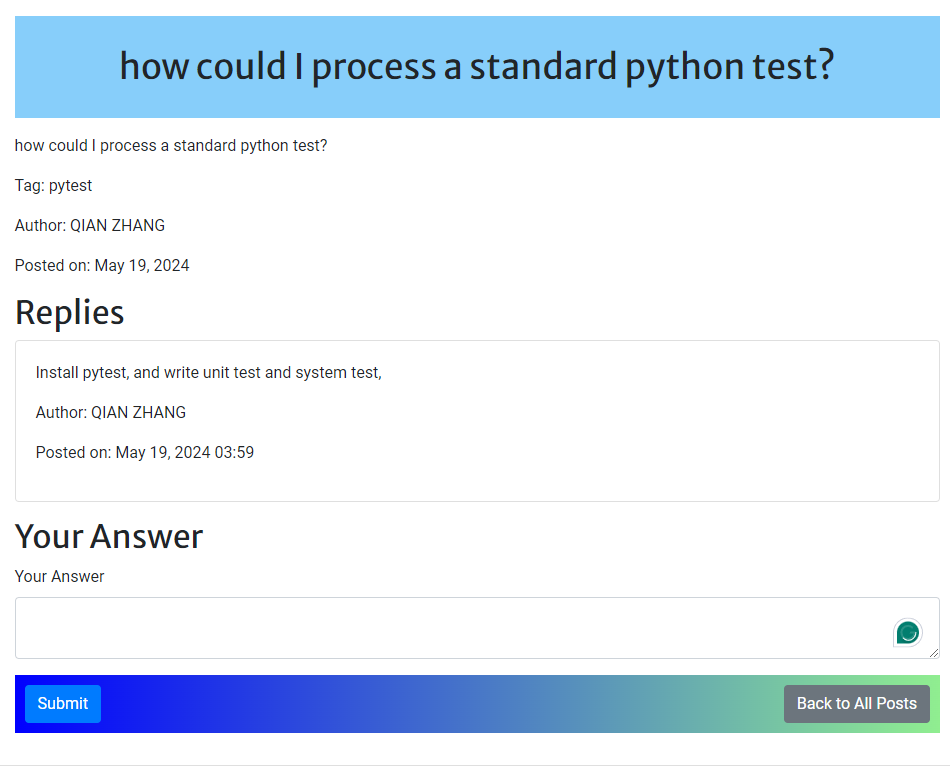


### 5. Voting and Sorting
Allow users to vote on questions and answers to increase or decrease their priority on the page, helping other users find the most useful information faster.
### 6. Marking Best Answers
Allow question askers to select and mark one answer as the best answer, making it easier for other users to find solutions.
### 7. Search and Filtering
Provide powerful search functionality allowing users to filter and search questions and answers based on keywords, tags, users, etc.
### 8.User Reputation and Badge System
Provide users with a reputation or badge system based on their contributions (such as asking questions, providing answers, voting, etc.) to evaluate their credibility and potentially provide privileges or rewards.
### 9. Community Management Tools
Provide tools and features such as reporting, banning, deleting, etc., to manage inappropriate behavior and content and maintain community order.
### 10. Community Dashboard
Provide a dashboard or homepage that displays the most popular, recent, and unanswered questions, as well as other relevant information to help users navigate the platform.
### 11. Notification and Alerts
Allow users to receive notifications about their questions, answers, and comments to stay informed about relevant activity.

## Getting Started
### Requirements
- [Python 3.9 or newer](https://www.python.org/downloads/)
- [Pip 21.1 or newer](https://pip.pypa.io/en/stable/installation/)
- [Git](https://git-scm.com/downloads)
- [Virtualenv](https://virtualenv.pypa.io/en/latest/installation.html) (Optional)


### Virtual Environment
It is recommended to use a virtual environment to run this project. To create a virtual environment, follow the instructions in the [Getting Started](./docs/Getting-Started.md) section. If you are using a virtual environment, make sure to activate it before installing the dependencies.

### Clone the Repository
To clone the repository, run the following command:
```
git clone https://github.com/ramandatta87/CITS5505_UWA_Group_Project.git
```
### Install Dependencies
To install all the dependencies, run the following command:
```
cd CITS5505_UWA_Group_Project
pip install -r requirements.txt
```
### Run the Application
To run the application, run the following command:
```
flask run
```
The application will be running on http://localhost:5000/ by default.

### Linting and Formatting
To lint the code, run the following command, with the option `--show-source` to show the source code of the errors and `--fix` to fix the errors automatically:
```
ruff check .
```
To format the code, run the following command, with the option `--check` to check if the code is formatted correctly and `--diff` to show the differences between the original and formatted code:
```
python -m black .
```
### Testing
To run the test suite, run the following command:
```
pytest
```
To be decided

### Accessing the API Documentation
To be decided

## User Guide
To be decided

## Developer Guide
To be devided

## Contributing
To be decided

## License
To be decided