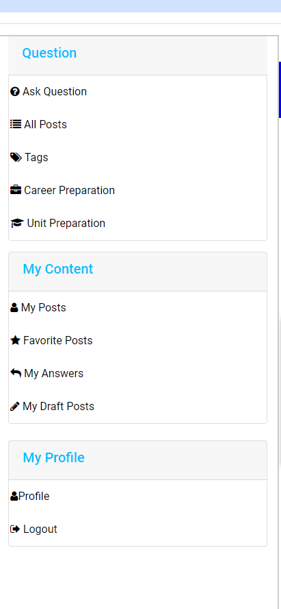
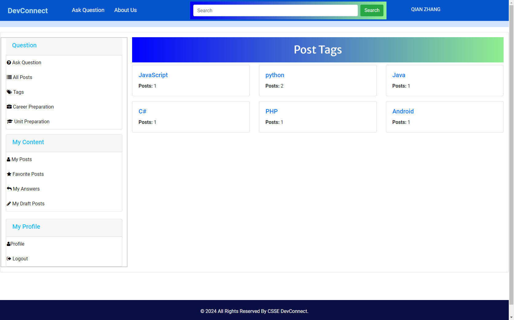
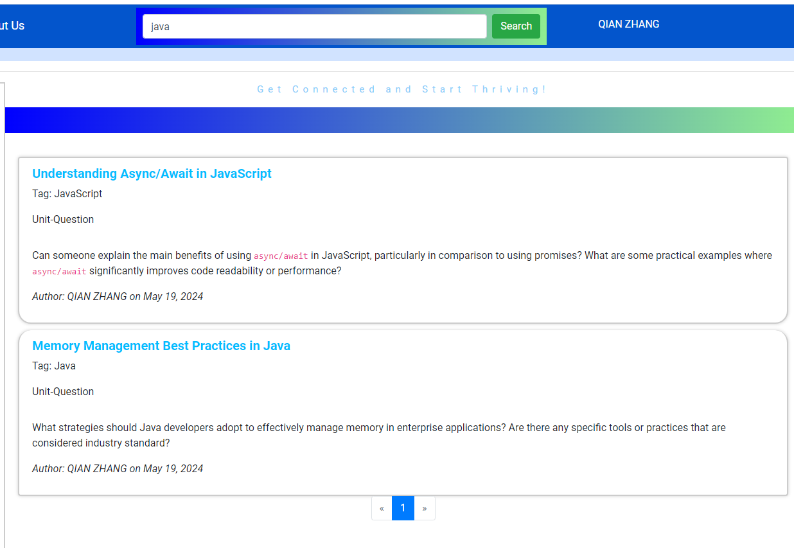

## Function
### 1. User Account Management
Allow users to create accounts, log in, and log out, manage their profiles, and reset password.
#### Create Account(Sign up)

#### Log in the account

#### Manage the profile

### 2. Question Posting and Editing
Users can post new questions and edit/update existing ones. Users can also save an unfinished question as a draft, and edit/post it in my draft posts.
#### Question posting
This form allows users to submit questions on the web application. It features several fields that need to be filled out before submission:
- **Title**: The title of the question users wish to ask.
- **Tag**: Relevant tags to categorize the question, which help in navigating and searching for questions within the system.
- **Question Type**: Users can select between two types of questions:
  - `Unit Question` - Pertaining to specific units or modules in a course.
  - `Career Preparation` - Questions aimed at career advice or professional growth.
- **Content**: The main text area where users can type the content of their question. The text editor supports various formatting options like bold, italic, list, quote, and code formatting.

#### View and reply question users have post
In the "My Posts" section of the web application, users can view their previously posted questions and respond to posts from other users. Each post is displayed with relevant details such as the title, tag, and the author's name, along with the date it was posted. Users can also enter replies to any post viewed.
Upon navigating to the "My Posts" section, users are presented with a list of their questions. Each question is displayed in a box that includes:
- **Title**: Clearly displayed at the top.
- **Tag**: Shows the categorization tag for quick reference.
- **Author**: The name of the user who posted the question.
- **Date Posted**: The specific date the question was posted.

When a user clicks on a question, they are taken to a detailed view where they can read the full content of the question and see existing replies. Below the replies section, there is an input area where users can type their answer:
- **Your Answer**: A text box where users can write a reply to the question.
- **Submit Button**: After typing their response, users can submit it by clicking this button.

### 3. Question Search and Answer Questions
User can click different buttons to access to different categories for questions.User can access Search function to input keywords for interesting topic, and users can also use synatax: [tag] keyword to search quesitons under specific tags.  
#### Quesitons View through sidebar menu
The sidebar menu includes the following main components for navigation:
- **Ask Question**: Directs users to a form to submit a new question.
- **All Posts**: Displays all questions posted on the platform.
- **Tags**: Lists all tags used in the questions, allowing users to click on a tag to see all related posts.
- **Career Preparation**: Filters and shows posts related to career advice and professional development.
- **Unit Preparation**: Filters and shows posts related to specific academic or training units.

##### All Post, and Filter questions via  **Career Preparation** and **Unit Preparation**
Upon selecting a category such as "Unit Preparation" or "Career Preparation," users are presented with a list of relevant questions. Each question is displayed with:
- **Title**: A brief description of the question.
- **Tag**: Relevant tags that categorize the question.
- **Author**: The name of the user who posted the question.
- **Date**: When the question was posted.

##### Post filter under tags
By selecting "Tags" from the sidebar, users can view a comprehensive list of all tags used within the platform, each displaying the count of associated posts. Clicking on a tag filters the posts accordingly.

#### Quesitons View through Search
The search functionality in the application allows users to efficiently find questions based on keywords and tags. This powerful tool supports searching by just keywords or a combination of a tag and keywords to provide precise results.

##### Keyword Search
Users can type any keyword related to the questions they are interested in into the search box and press the "Search" button. The application will retrieve all questions that contain the keyword in the title, tags, or content.

##### Tag and Keyword Search
To refine search results to include specific tags, users should use the format `[tag] keyword` in the search box. For example, entering `[pytest] test` will return questions tagged with 'pytest' and containing the word 'test'.

#### Answer Question
This application allows users to view detailed information about a specific question, see existing replies, and contribute their own answers. This functionality is central to fostering an interactive and helpful community on the platform.

