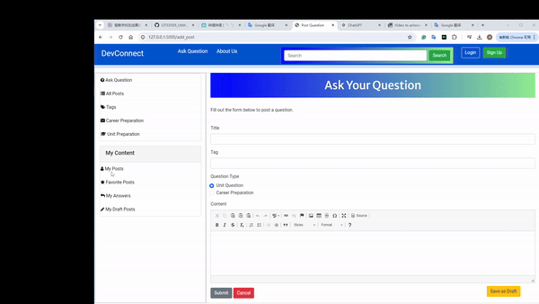
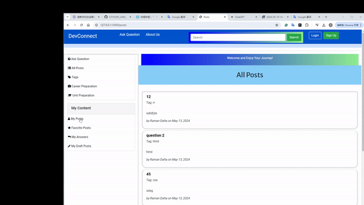

# Happy Scenarios

## Overview
These scenarios represent ideal user interactions with the web application, where operations complete successfully and fulfill user expectations.

### Scenario 1: Posting a Question
- **Given**: User is logged in and navigates to the "Ask Question" section.
- **When**: User fills out the question form with a valid title, selects an appropriate tag, enters the content, and submits the form.
- **Then**: The question is successfully posted to the platform, and the user receives a confirmation message.

### Scenario 2: Searching for Questions
- **Given**: User wants to find specific questions.
- **When**: User enters a keyword into the search box and initiates the search.
- **Then**: The system displays all relevant questions containing the keyword.

### Scenario 3: Adding a Reply
- **Given**: User reads a question of interest.
- **When**: User enters a reply in the "Your Answer" text area and submits it.
- **Then**: The reply is posted under the question, and the user sees their contribution immediately.

### Scenario 4: Saving and Accessing Drafts
- **Given**: User starts composing a question but needs to save it for later.
- **When**: User clicks the "Save as Draft" button.
- **Then**: The draft is saved, and the user receives a confirmation. The draft can be accessed and edited later from "My Draft Posts".

### Scenario 5: Filtering Questions by Tags
- **Given**: User is looking for questions in a specific category.
- **When**: User selects a tag from the sidebar or the "Tags" section.
- **Then**: Only questions associated with the selected tag are displayed, allowing for focused browsing.
