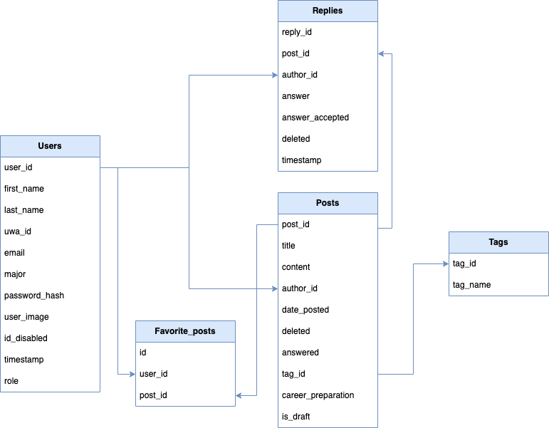

# Database Design and Implementation

## Overview
This document provides an overview of the database schema used in the CITS5506 Project. The database is structured to support the application's functionality, including user management, post handling, replies, and tagging system.

## Schema Description

The database consists of five main tables: `Users`, `Posts`, `Replies`, `Tags`, and `Favorite_posts`. Below is a detailed description of each table and their relationships.

### Tables and Relationships

#### 1. Users
- **Description**: Stores information about the users of the application.
- **Fields**:
  - `user_id`: Primary key, uniquely identifies a user.
  - `username`: User's chosen username.
  - `email`: User's email address.
  - `password_hash`: Hashed password for security.

#### 2. Posts
- **Description**: Contains all posts made by users.
- **Fields**:
  - `post_id`: Primary key, uniquely identifies a post.
  - `user_id`: Foreign key from `Users`, identifies the creator of the post.
  - `content`: Text content of the post.
  - `tag_id`: Foreign key from `Tags`, denotes the tag associated with the post.

#### 3. Replies
- **Description**: Holds replies to posts.
- **Fields**:
  - `reply_id`: Primary key, uniquely identifies a reply.
  - `post_id`: Foreign key from `Posts`, the post to which this reply belongs.
  - `user_id`: Foreign key from `Users`, the user who made the reply.
  - `content`: Text content of the reply.

#### 4. Tags
- **Description**: Manages tags that can be associated with posts.
- **Fields**:
  - `tag_id`: Primary key, uniquely identifies a tag.
  - `tag_name`: The name of the tag.

#### 5. Favorite_posts
- **Description**: Links users to their favorite posts.
- **Fields**:
  - `user_id`: Foreign key from `Users`, the user who favorited the post.
  - `post_id`: Foreign key from `Posts`, the post that was favorited.

### Entity-Relationship Diagram

The following diagram illustrates the relationships between the various tables in the database:

## Implementation

The database is implemented using SQLite, chosen for its simplicity and ease of integration with web applications.