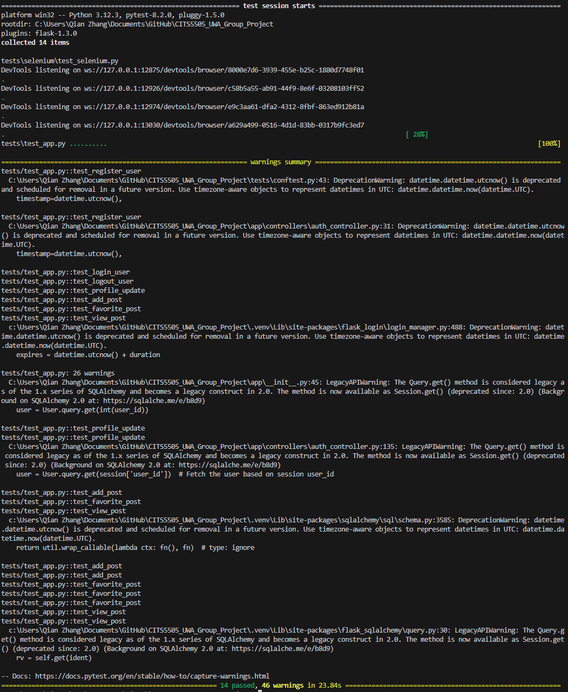

# Testing Documentation

## Test Environments
- **Local Development**: Testing on developers' machines before changes are committed.
- **Staging Environment**: Final testing in a production-like environment before deployment.

## Test Tools
- **Pytest**: For running Python-based tests.
- **Flask Testing**: Utilizing Flask's test client for simulated requests and responses.
- **Selenium**: For automated browser-based tests to verify frontend functionality and user interactions.

## Test Cases

### Functional Tests

#### Test Case 1: Posting a Question
- **Objective**: Verify that users can post questions successfully.
- **Method**: `test_add_post`
- **Expected Result**: The question is posted and visible under the correct sections.

#### Test Case 2: User Authentication
- **Objectives**:
  - **Register User**: Confirm that a new user can register.
  - **Login User**: Validate user login functionality.
  - **Logout User**: Ensure users can log out.
- **Methods**: `test_register_user`, `test_login_user`, `test_logout_user`
- **Expected Results**: Users can register, login, and logout successfully.

#### Test Case 3: User Profile Management
- **Objective**: Confirm that users can update their profile details.
- **Method**: `test_profile_update`
- **Expected Result**: User's profile is updated correctly.

#### Test Case 4: Interactions with Posts
- **Objectives**:
  - **Add a Favorite Post**: Test the functionality to mark a post as a favorite.
  - **View a Post**: Ensure that post details can be accessed and are displayed correctly.
- **Methods**: `test_favorite_post`, `test_view_post`
- **Expected Results**: Posts can be favorited and viewed with all details correct.

#### Test Case 5: Navigation and Accessibility
- **Objective**: Confirm the homepage and critical navigation elements are accessible and render as expected.
- **Method**: `test_home_page`
- **Expected Result**: The homepage loads successfully with expected content.

#### Selenium Frontend Tests
- **Objective**: Ensure that the frontend pages load correctly and user interactions like signing up, logging in, and form submissions work as intended.
- **Scenarios**:
  - **Homepage Load**: Test if the homepage loads with the correct title.
  - **Sign Up and Login Links**: Verify that 'Sign Up' and 'Login' links are present and functional.
  - **Registration Form Elements**: Ensure all elements in the registration form are present and can be interacted with.
- **Expected Results**: All frontend elements function correctly, and the site is navigable.


### Test Reporting
- run```flask run```,and open another ternimal to next step.
- run```pytest```and the result is below:
